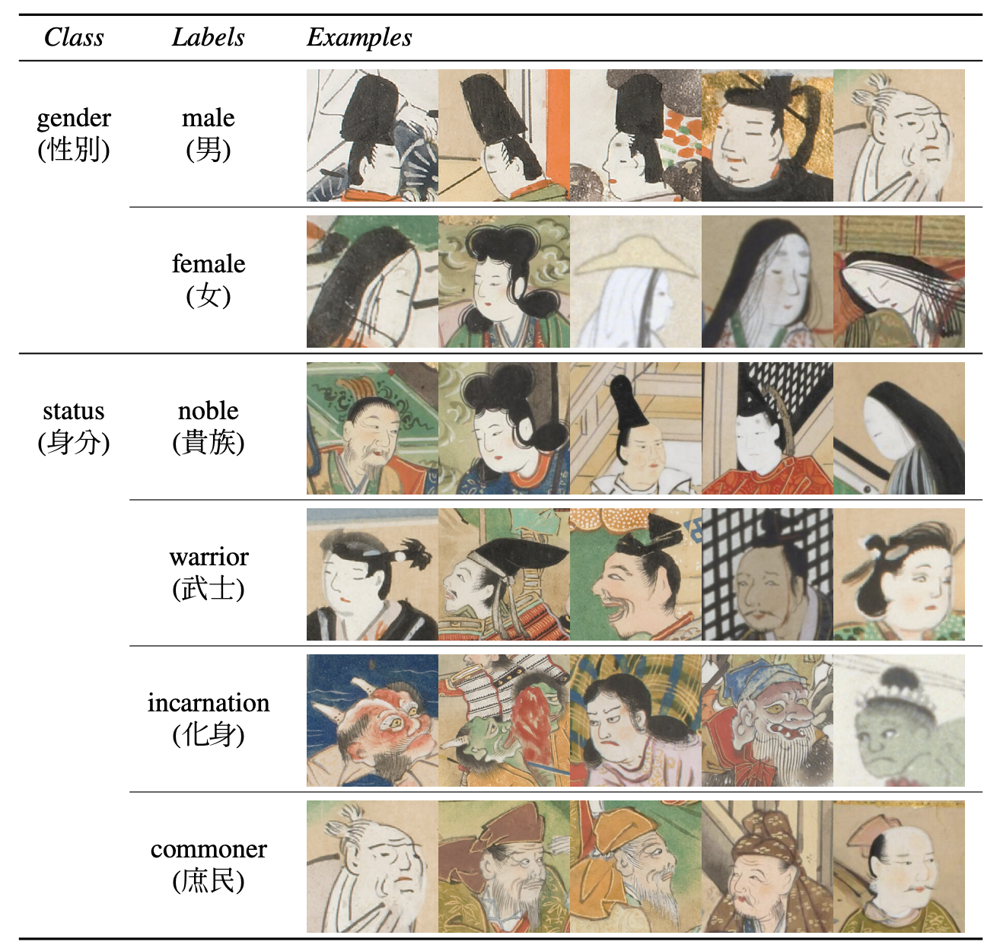

# probspace_kaokore_status_takasan
# はじめに
こちらは2022年にProbSpaceにて開催されたコンペティション「日本画の登場人物分類」の解法および使用コードになります。

URL：https://comp.probspace.com/competitions/kaokore_status

# タスクの概要
日本画のデータセット「KaoKore」を使って、各画像から登場人物の身分を分類する（４クラス分類）。  
評価指標は、Macro F1 Score。

  

   
  データセットの画像とラベルの例。今回は身分のみの分類である。

KaoKoreデータセット：
https://github.com/rois-codh/kaokore/blob/master/README.md

# 解法解説

# 有効だった手法
- 擬似ラベル
- アンサンブル
- Trivial Augment
- Rand Augment
- Focal Loss
- Cosine Annealing

# あまり有効でなかった手法
- Lable Smoothing
- Warm up
- Class weight
- Fine tuning
- 対照学習

# 今回試せなかった手法
- ViT, Swin
- 距離学習
- Optuna
- AdamW
- 少数クラス（平民）への対処
    - 平民のデータが少なく、精度が低くなっていた
        - 貴族かそれ以外の2値分類 → 3クラス分類などの工夫をする
        - GANによるData Augmentationを行う
        - ダウンサンプリング
- ノイズとなるデータの除去
    - 顔以外の画像などがノイズとなっていた？
- TTA
- アンサンブル方法の検証

# 反省点
- 実験管理をきちんとする
    - 序盤は場当たり的に行っていたので、終盤に何をすべきかわかりにくくなってしまった
- LBに最適化しすぎない（LBスコアとCVスコアと照らし合わせる）
    - Public 11位 → Private 22位となってしまった

# おわりに
画像分類やコンペ一般に関してのノウハウを学ぶことができました。  
今回の反省点を踏まえて、また新たなコンペにも取り組んでいこうと思います。  
最後になりましたが、チームメンバーと関係者各位に感謝申し上げます。

# 参考
- 1st place solution  
https://github.com/bysk2/probspace_kaokore_status_1st_solution
- 1st place solution @ Nishikaでの類似コンペ
https://github.com/3017218062/Ancient-Portrait-Classification#5